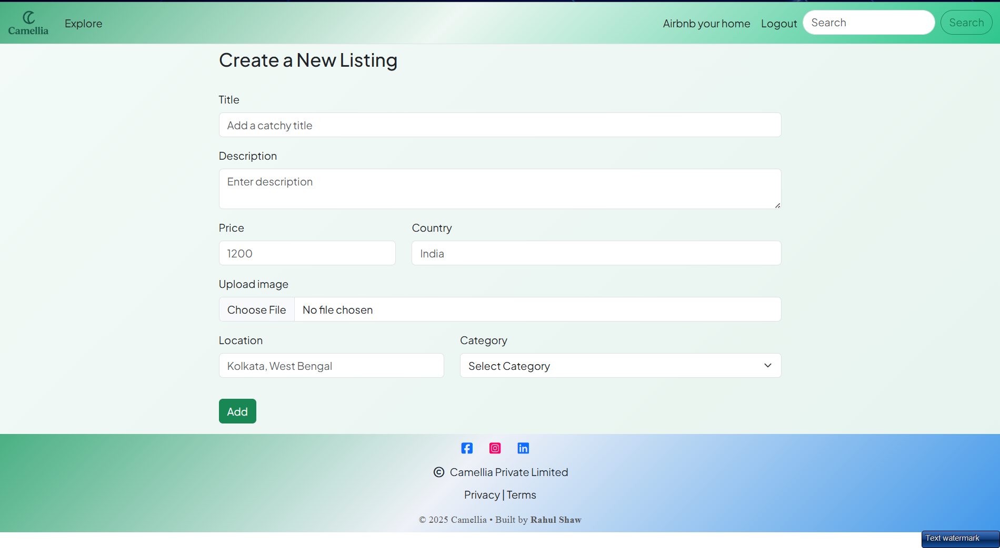
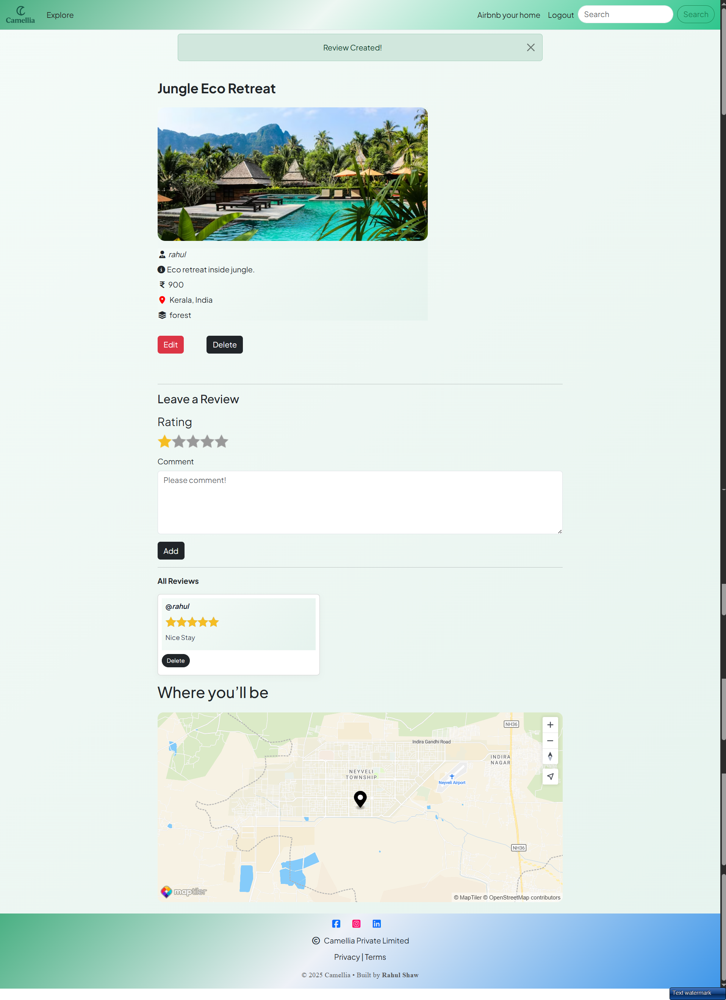
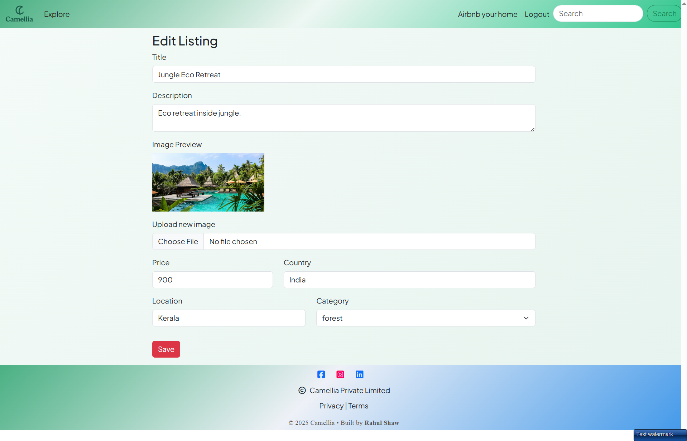
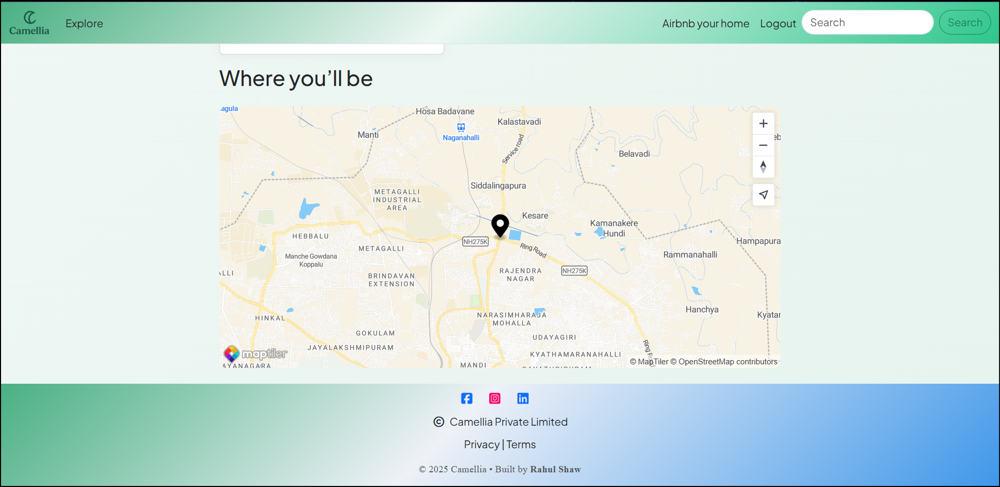
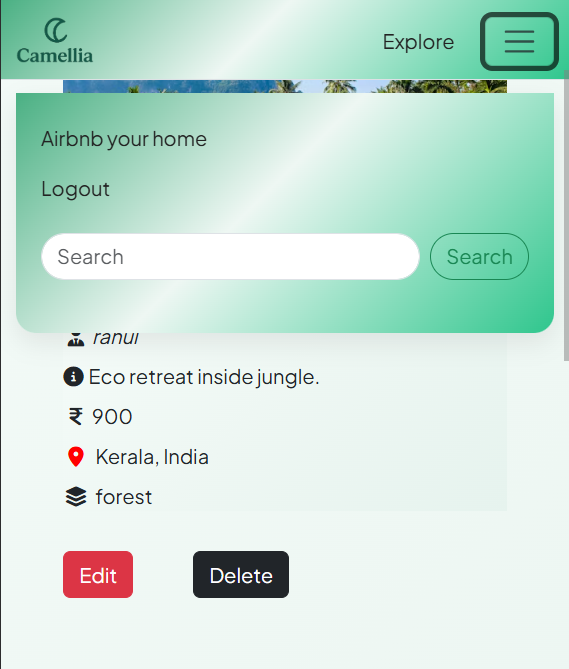
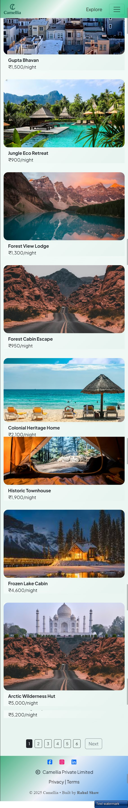

# CAMELLIA – Airbnb-Style Rental Platform (Major Project)

CAMELLIA is a **production-ready, full-stack rental platform** inspired by Airbnb, built from scratch with a strong focus on **backend engineering, clean architecture, and a fully responsive user interface**.

The application works seamlessly across **mobile, tablet, and desktop devices**, ensuring a consistent user experience on all screen sizes.

🔗 **Live Project:** https://major-project-zz1b.onrender.com  
🔗 **GitHub Repository:** https://github.com/CODER-RAHUL9038/MAJOR_PROJECT/tree/main/CAMELLIA

---

## 🎥 Demo & Screenshots

### Home Page

### Create Listing

### Listing Details

### Edit Listing

### Map Integration

### Navbar View

### Mobile View

## 🚀 Core Features (Backend Focused)

### 📱 Fully Responsive Design

- Mobile-first, responsive UI
- Optimized for **mobile, tablet, and desktop** screens
- Seamless user experience across all devices
- Built using Bootstrap grid system and responsive utilities

### 🔐 Authentication & Authorization

- Local authentication using **Passport.js**
- Session-based login system
- Middleware-protected routes
- Authorization checks to ensure:
  - Only owners can edit/delete listings
  - Only logged-in users can create reviews

### 🏠 Listings Management

- Full CRUD operations for listings
- Secure image upload using:
  - Multer (file handling)
  - Cloudinary (cloud storage)
- Clean request body parsing & validation
- Ownership checks before updates or deletion

### ⭐ Reviews & Ratings

- One-to-many relationship between listings and reviews
- Average rating calculation
- Secure deletion with ownership validation

### 🗺️ Map Integration

- Location-based listing mapping using **MapTiler**
- Input sanitization and location cleanup
- Geocoding for accurate coordinates

### 🔍 Search, Filters & Pagination

- Regex-based text search
- Category-based filtering
- Pagination using `limit` & `skip` for performance

### ⚠️ Error Handling & Validation

- Centralized error-handling middleware
- Custom error class
- Graceful handling of:
  - Invalid Object IDs
  - Unauthorized access
  - Missing resources

---

## 🧠 Backend Architecture

- **MVC Pattern**
  - Models → Database logic
  - Controllers → Business logic
  - Routes → Request handling
- **Middleware-based design**
  - Authentication
  - Authorization
  - Error handling
- **RESTful APIs**
- Clean and scalable structure

---

### 🔐 Social Authentication (Planned)

- Google OAuth 2.0 login
- Facebook login
- LinkedIn login
- Secure OAuth-based authentication using Passport strategies
- Optional account linking with existing local accounts

## 📘 API Documentation

### 🔐 Authentication Routes

| Method | Route     | Description        |
| ------ | --------- | ------------------ |
| GET    | `/login`  | Render login page  |
| POST   | `/login`  | Authenticate user  |
| GET    | `/signup` | Render signup page |
| POST   | `/signup` | Create new user    |
| GET    | `/logout` | Logout user        |

---

### 🏠 Listings Routes

| Method | Route                | Description                |
| ------ | -------------------- | -------------------------- |
| GET    | `/listings`          | Get all listings           |
| GET    | `/listings/new`      | Render create listing form |
| POST   | `/listings`          | Create new listing         |
| GET    | `/listings/:id`      | View single listing        |
| GET    | `/listings/:id/edit` | Render edit listing form   |
| PUT    | `/listings/:id`      | Update listing             |
| DELETE | `/listings/:id`      | Delete listing             |

---

### ⭐ Reviews Routes

| Method | Route                             | Description     |
| ------ | --------------------------------- | --------------- |
| POST   | `/listings/:id/reviews`           | Add a review    |
| DELETE | `/listings/:id/reviews/:reviewId` | Delete a review |

---

## 🛠️ Tech Stack

### Backend

- Node.js
- Express.js
- MongoDB
- Mongoose
- Passport.js
- Express-session

### Frontend

- EJS (Server-Side Rendering)
- HTML, CSS, JavaScript
- Bootstrap

### Tools & Services

- Cloudinary (Image Storage)
- Multer (File Uploads)
- MapTiler (Maps)
- Render (Deployment)

---

## 📚 Key Learning Outcomes (Interview Ready)

- Implemented secure authentication & authorization
- Designed RESTful APIs with proper middleware
- Handled file uploads in production
- Worked with real database relationships
- Managed deployment & environment variables
- Built scalable backend logic from scratch

---

## 🛣️ Project Roadmap

- [x] Local authentication with Passport.js
- [x] Authorization & protected routes
- [x] Image uploads with cloud storage
- [x] Map integration
- [x] Fully responsive UI across all devices
- [ ] Google OAuth authentication
- [ ] Facebook authentication
- [ ] LinkedIn authentication
- [ ] Account linking (local + social login)
- [ ] Security hardening (rate limiting, headers)

---

## 📌 Project Management

This project uses **GitHub Issues** to track bugs, enhancements, and future features.

👉 View planned features & issues here:
https://github.com/CODER-RAHUL9038/MAJOR_PROJECT/issues

---

## 👨‍💻 Author

**Rahul Shaw**  
Aspiring Backend / Full-Stack Developer  
Focused on building real-world, scalable applications 🚀

---

⭐ If you find this project valuable, consider giving it a **star** on GitHub!
