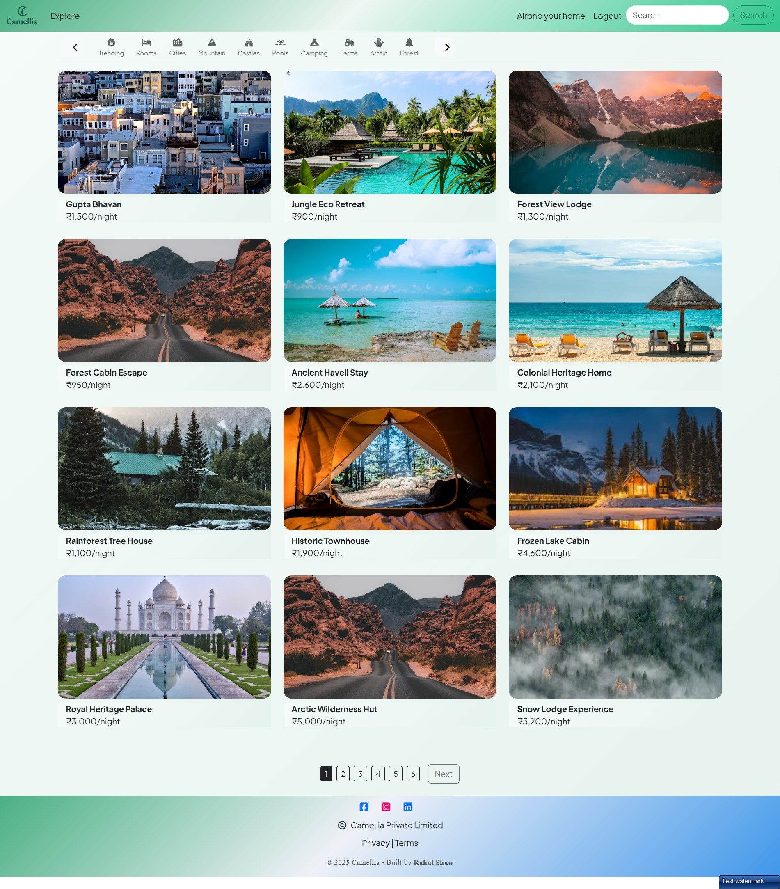
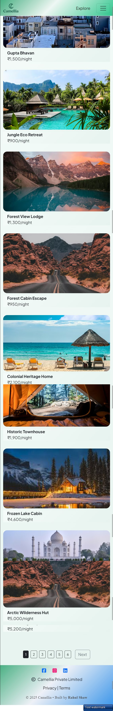
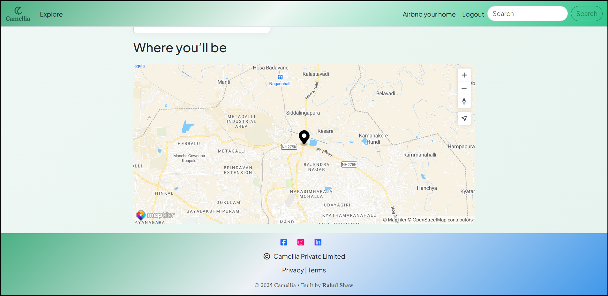

# 🌿 CAMELLIA | Airbnb-Style Premium Rental Platform

[](https://major-project-zz1b.onrender.com)
[](https://github.com/CODER-RAHUL9038/MAJOR_PROJECT)
[](https://nodejs.org)
[](https://opensource.org/licenses/ISC)

CAMELLIA is a **production-ready, full-stack rental platform** inspired by Airbnb. It's built with a focus on **clean architecture, luxury UI/UX, and robust backend engineering**, providing a seamless experience for hosts and travelers alike.

---

## 📸 Visual Showcase

### 🏠 Discover Luxury Stays


### 📱 Premium Mobile Experience


### 🗺️ Interactive Map Exploration


---

## ✨ Key Features

### 💎 Premium UI/UX (Airbnb Inspired)
- **Luxury Aesthetic:** A sophisticated slate and charcoal palette with "Playfair Display" and "Plus Jakarta Sans" typography.
- **Modern Toast System:** Fully custom, animated notification system replacing legacy alerts.
- **Polished Navigation:** Intelligently responsive navbar with a professional profile dropdown and unified avatar resolution.
- **Mobile-First Design:** Optimized specifically for high-end mobile UX, ensuring 0-gap alignment and perfect layering.

### 🔐 Advanced Security & Auth
- **Hybrid Authentication:** Seamlessly switch between local credentials and **Google OAuth 2.0**.
- **Smart Account Linking:** Automatically links Google logins to existing accounts via email to prevent duplicates.
- **Granular Authorization:** Multi-layer middleware ensuring only owners can modify their assets.

### 🏠 Property Management
- **Full CRUD:** Comprehensive lifecycle management for rental listings.
- **Cloud Storage:** Integrated with **Cloudinary** for high-performance image hosting and optimization.
- **Robust Validation:** Client and server-side validation using **Joi** and Bootstrap.

### ⭐ Engagement & Search
- **Smart Filters:** Category-based property filtering with a polished "Clear Filters" UI.
- **Text Search:** Fast, regex-powered search bar for finding properties by location or title.
- **Interactive Reviews:** Five-star rating system with user-specific ownership controls.

---

## 🛠️ Tech Stack

### Backend Engine


### Frontend Surface


### Services & Tools


---

## 🧠 Architectural Overview

Camellia follows the **MVC (Model-View-Controller)** design pattern for maximum scalability:

- **Models:** Mongoose schemas defining robust data structures for Listings, Reviews, and Users.
- **Views:** Dynamic server-side rendering using EJS and custom partials.
- **Controllers:** Clean separation of business logic from route definitions.
- **Middleware:** Centralized authentication, authorization, and error-handling logic.

---

## 🚀 Getting Started

### Prerequisites
- Node.js (v20+)
- MongoDB Atlas Account
- Cloudinary Account
- MapTiler API Key

### Installation

1. **Clone the repository:**
   ```bash
   git clone https://github.com/CODER-RAHUL9038/MAJOR_PROJECT.git
   cd MAJOR_PROJECT/CAMELLIA
   ```

2. **Install dependencies:**
   ```bash
   npm install
   ```

3. **Configure Environment Variables:**
   Create a `.env` file in the root directory:
   ```env
   CLOUD_NAME=your_cloudinary_name
   CLOUD_API_KEY=your_cloudinary_key
   CLOUD_API_SECRET=your_cloudinary_secret
   ATLASDB_URL=your_mongodb_atlas_url
   SESSION_SECRET=your_secure_secret
   MAP_TOKEN=your_maptiler_key
   GOOGLE_CLIENT_ID=your_google_id
   GOOGLE_CLIENT_SECRET=your_google_secret
   ```

4. **Run the application:**
   ```bash
   npm start
   ```

---

## 📁 Project Structure

```
CAMELLIA/
├── config/             # Configuration (Passport, Cloudinary)
├── controllers/        # Business Logic
├── init/               # Database Seeding Tools
├── models/             # Mongoose Schemas
├── public/             # Static Assets (CSS, JS, Images)
├── routes/             # RESTful Route Definitions
├── utils/              # Helper Classes & Error Handlers
├── views/              # EJS Templates & Layouts
├── app.js              # Application Entry Point
└── schema.js           # Joi Validation Schemas
```

---

## 👨‍💻 Credits

**Rahul Shaw**  
*Lead Developer & UI/UX Designer*

Highly motivated full-stack developer focused on building high-performance, real-world applications with clean, maintainable code.

[](https://www.linkedin.com/in/coder-rahul-shaw/)
[](https://github.com/CODER-RAHUL9038)

---

⭐ If you find this project valuable, please consider giving it a **star** on GitHub!
